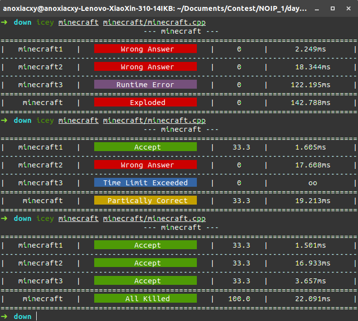

##  Icey Local Judge
****
   

欢迎使用 icey，本文档将帮助你快速上手。如果您在使用的过程中遇到了问题，请查看 FAQ 中的解答，或者在本项目下经行提问。

```
icey [OPTION]... DATA... CODE...
```
****
### 什么是 icey ?

icey 是一款轻量级的开源 OI 本地评测系统。由 [Anoxiacxy](https://anoxiacxy.github.io) 和 [Edgration](www.)

你可以用简短的几句命令，对您的程序进行快速，精确地评测，并得到一份关于评测的报告。

### 安装

想要安装 icey 相当简单，

首先从下载本项目的源文件，打开文件夹之后，将可执行文件 `icey` 拷贝到 `usr/bin/` 目录下即可全局使用。

懒人命令如下

``` bash
git clone https://github.com/Edgration/icey.git
cd icey
sudo cp icey /usr/bin/
```

对于没有安装 `git` 的童鞋，可以使用以下命令安装

``` bash
sudo apt-get install git
```

### 卸载

可以直接使用以下命令完成卸载

```
sudo rm /usr/bin/icey
```
### 使用说明

#### 

#### 本地评测

```
icey [OPTION]... DATA... CODE...
```

其中`DATA` 是一个目录  ，`CODE` 是一个文件，表示利用 `DATA` 目录下的数据来评测 `CODE` 这份代码

#### 关于 DATA

`DATA`必须是一个非空的目录。

这个目录可以是关于系统的绝对路径，也可以是关于当前工作目录的相对路径。

该目录下，可存放若干组测试数据，每组测试数据的格式形如

```
name1.in
name1.out
```

即 `名称` + `编号` + `.in/.out` 。

icey 会从目录中识别此格式的文件并配对，测试数据的名称可以为空，但是必须有互相配对的编号。

~~另外，你可以使用 `-i=IN`，`-o=OUT`来指定测试数据的后缀名。~~

#### 关于 CODE

`CODE`必须是一个非空的文件。

这个文件可以是关于系统的绝对路径，也可以是关于当前工作目录的相对路径。

该文件中，有且仅有一份以`c++`语言编写的源代码。

请确保程序中没有使用 `freopen` 等函数，以免对评测结果产生影响。

#### 关于 [OPTION]

这些参数为可选参数，当你需要的时候可以适当添加。

| 格式          | 描述                     |
| :-------------: | ------------------------ |
| -h, --help    | 显示本评测系统的帮助信息 |
| -v, --version |     显示本评测系统的版本信息  |
| -t, --time=SECOND | 可以设置每个测试点的时间限制，单位为秒，可以是浮点数，默认为 1 |
| -c, -C[opt] | 可以添加编译选项，例如想添加`-O2` ，可以添加参数`-CO2`；如果想使用`c++11`，即编译选项`-std=c++11`，可以添加参数`-Cstd=c++11` |

#### 关于评测结果

单个测试点

- AC：Accept，程序通过。

- CE：Compile Error，编译错误。

- WA：Wrong Answer，答案错误。

- RE：Runtime Error，运行时错误。

- TLE：Time Limit Exceeded，超出时间限制。

- ~~MLE：Memory Limit Exceeded，超出内存限制。~~

- UKE：Unknown Error，出现未知错误

最终评测结果

- AK：All Killed，通过了全部测试点。

- PC：Partially Correct，部分正确。

- GG：Exploed，很不幸，你爆零了。 
  

### FAQ


